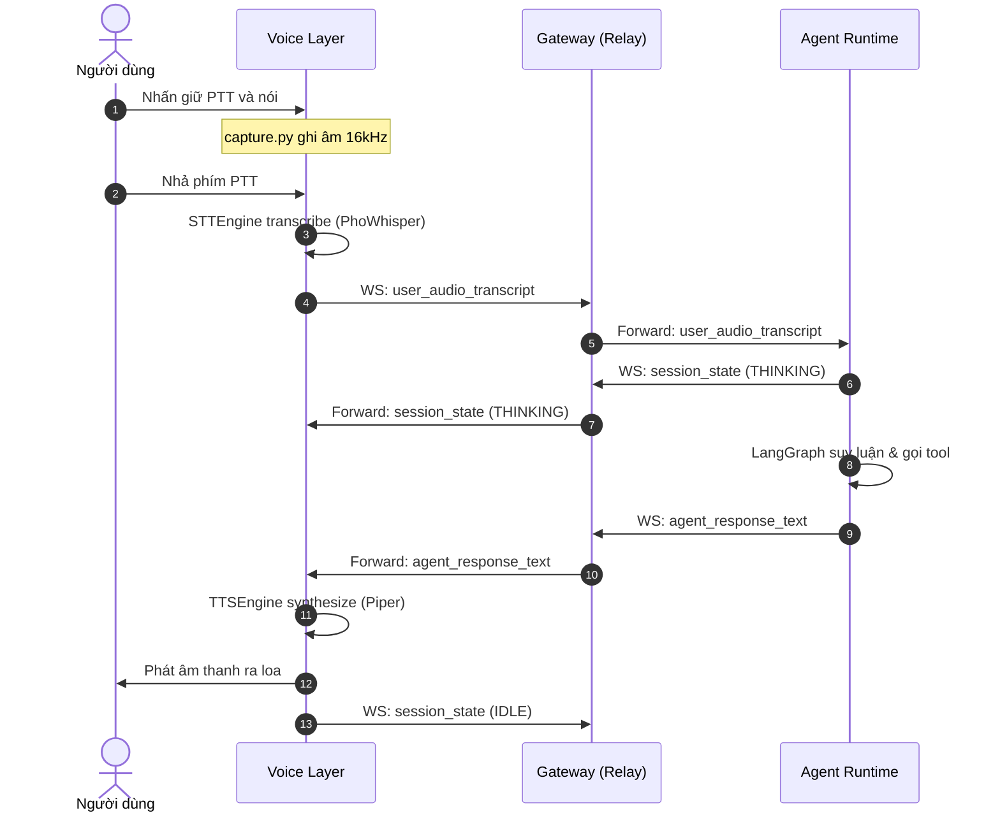

# WebSocket API Contract: Gateway ↔ Agent Runtime (v1 — Phase 1 PoC)

Tài liệu này đặc tả giao thức giao tiếp thời gian thực qua **WebSocket** giữa **Gateway** (Spring Boot) và **Agent Runtime** (Python / LangGraph), phục vụ trực tiếp cho vòng lặp thoại (Voice Loop) của Jarvis.

---

## 1. Ranh giới kiến trúc & Bảo mật

Theo quy tắc bất khả xâm phạm tại `CLAUDE.md`:
1. **Ranh giới Network**: WebSocket server lắng nghe **DUY NHẤT** trên `127.0.0.1` (cùng máy vật lý). Tuyệt đối không bind ra `0.0.0.0` hay LAN/Internet.
2. **Vai trò Gateway**: Gateway **CHỈ** đóng vai trò proxy/relay và router thông điệp. Gateway **KHÔNG** chứa prompt template, không parse hay phân tích ngữ nghĩa câu thoại, không gọi tool hay chứa Agent logic.
3. **Phạm vi Phase 1 (Minimal Voice Loop)**:
   - Trao đổi chuỗi văn bản hoàn chỉnh (`turn-based`), chưa streaming từng token LLM.
   - Chưa tích hợp ngắt lời tức thì (`barge-in`) — tính năng này sẽ hoàn thiện ở Phase 5.

---

## 2. Giao thức & Kết nối

- **URL Endpoint**: `ws://127.0.0.1:8080/ws/agent` (hoặc `ws://127.0.0.1:8000/ws/agent` khi Agent Runtime làm server).
  - *Mô hình v1 PoC*: Gateway đóng vai trò WebSocket Server tại `ws://127.0.0.1:8080/ws/voice` tiếp nhận client từ Voice Layer, và forward sang Agent Runtime (qua HTTP/WebSocket).
- **Format dữ liệu**: JSON, mã hóa `UTF-8`.

---

## 3. Envelope Cấu trúc Thông điệp (Message Envelope)

Mọi thông điệp trao đổi giữa các bên đều tuân thủ cấu trúc chuẩn:

```json
{
  "type": "string",
  "session_id": "string",
  "message_id": "string",
  "timestamp": 1789209600000,
  "payload": {}
}
```

### Các trường metadata bắt buộc:
- `type`: Định danh loại sự kiện / thông điệp.
- `session_id`: UUID của phiên hội thoại hiện tại (dùng để truy vết context).
- `message_id`: UUID duy nhất của từng bản tin.
- `timestamp`: Epoch timestamp (miliseconds).
- `payload`: Đối tượng dữ liệu nghiệp vụ tùy thuộc vào `type`.

---

## 4. Các loại thông điệp chính (Message Types)

### 4.1. `user_audio_transcript` (Voice Layer → Gateway → Agent Runtime)
Được phát ra khi Voice Layer hoàn thành nhận dạng giọng nói từ người dùng qua STT.

```json
{
  "type": "user_audio_transcript",
  "session_id": "9a6cd346-b5a7-465f-9487-9da609361bcd",
  "message_id": "msg-1788942-001",
  "timestamp": 1789209600100,
  "payload": {
    "text": "bây giờ là mấy giờ rồi",
    "stt_duration_ms": 312.5,
    "confidence": 0.98,
    "language": "vi"
  }
}
```

### 4.2. `session_state` (Gateway / Agent Runtime ↔ Voice Layer / UI)
Đồng bộ trạng thái chu trình tương tác cho Voice Layer và UI Desktop (đổi màu vòng tròn, hiệu ứng audio visualizer).

```json
{
  "type": "session_state",
  "session_id": "9a6cd346-b5a7-465f-9487-9da609361bcd",
  "message_id": "msg-1788942-002",
  "timestamp": 1789209600150,
  "payload": {
    "state": "THINKING",
    "detail": "Agent is executing get_current_time tool"
  }
}
```

Các giá trị hợp lệ của `state`:
- `IDLE`: Đang chờ người dùng kích hoạt / giữ phím.
- `LISTENING`: Đang thu âm giọng nói từ Microphone.
- `TRANSCRIBING`: Đang chạy mô hình STT.
- `THINKING`: Agent Runtime đang suy luận, gọi tool hoặc sinh câu trả lời.
- `SPEAKING`: Voice Layer đang đọc câu trả lời qua TTS ra loa.

### 4.3. `agent_response_text` (Agent Runtime → Gateway → Voice Layer)
Được phát ra khi Agent Runtime hoàn thành luồng LangGraph và có câu trả lời cuối cùng để Voice Layer đưa vào TTS.

```json
{
  "type": "agent_response_text",
  "session_id": "9a6cd346-b5a7-465f-9487-9da609361bcd",
  "message_id": "msg-1788942-003",
  "timestamp": 1789209600850,
  "payload": {
    "text": "Bây giờ là 16 giờ 45 phút, ngày 12 tháng 9 năm 2026.",
    "tools_executed": ["get_current_time"],
    "execution_duration_ms": 700.0
  }
}
```

### 4.4. `error` (Bất kỳ phía nào gặp sự cố)
Thông báo lỗi chuẩn tắc giữa các component.

```json
{
  "type": "error",
  "session_id": "9a6cd346-b5a7-465f-9487-9da609361bcd",
  "message_id": "msg-1788942-004",
  "timestamp": 1789209600900,
  "payload": {
    "code": "AGENT_TIMEOUT",
    "message": "Agent Runtime không phản hồi sau 5000ms"
  }
}
```

---

## 5. Trình tự luồng tương tác thoại (Sequence Diagram)



---

## 6. Đối chiếu chỉ số độ trễ (NFR-01 SLA: < 1.5–2s)

| Giai đoạn | Thành phần | Thời gian mục tiêu | Đo đạc tại |
|---|---|---|---|
| 1. STT Inference | `voice-layer/src/stt` | 200 – 400 ms | `stt_start` → `stt_end` |
| 2. Gateway Relay | `gateway` | < 10 ms | Ingress → Egress timestamp |
| 3. Agent Execution | `agent-runtime` | 400 – 800 ms | Graph start → Final response |
| 4. TTS Synthesis & First Audio | `voice-layer/src/tts` | 150 – 300 ms | Text received → Audio playback |
| **Tổng cộng toàn trình (E2E)** | **Voice Loop** | **~800 – 1500 ms** | **Đạt NFR-01 (< 2.0s)** |
